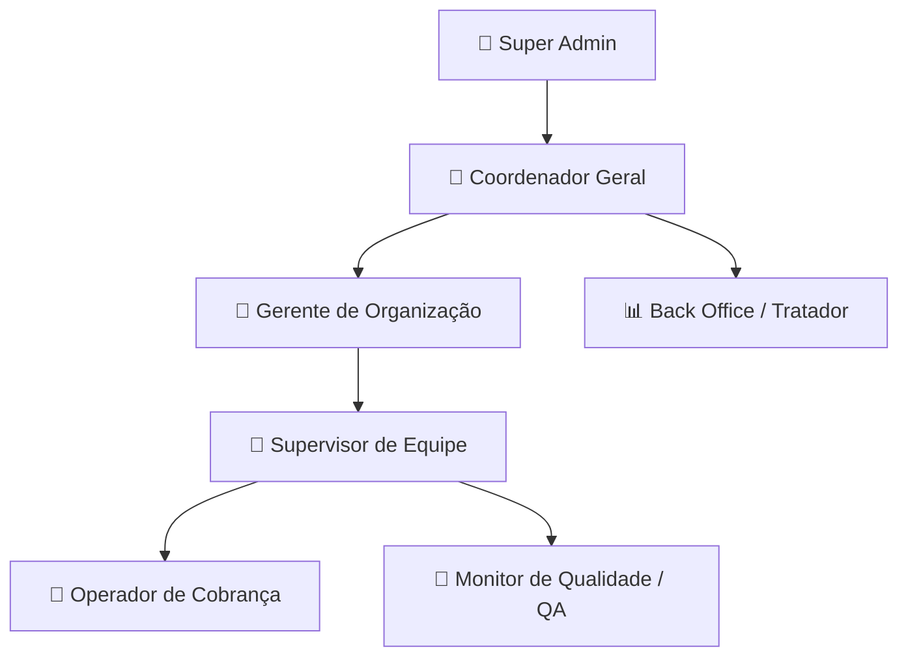

# ⚡ Tracker SaaS — Gestão Inteligente de Acordos & Recuperação de Crédito

[](https://react.dev/)
[](https://www.typescriptlang.org/)
[](https://vitejs.dev/)
[](https://tailwindcss.com/)
[](https://firebase.google.com/)
[](https://grafana.com/)
[](https://sonarcloud.io/)

Plataforma corporativa de **alta performance (Multi-Tenant)** voltada para a gestão de cobrança, conciliação financeira, BI analítico preditivo e monitoramento em tempo real de equipes operacionais. Unindo **Compliance LGPD rigoroso**, **Observabilidade com Grafana**, **Resiliência Offline-First** e **arquitetura de baixo custo de nuvem**.

---

## 🌟 Principais Pilares do Sistema

| Pilar | Descrição |
| :--- | :--- |
| **🏢 Multi-Tenant Isolado** | Isolamento físico e lógico absoluto de dados por organização no Firebase Firestore. |
| **🔒 Compliance LGPD Nativo** | Mascaramento dinâmico de CPF/valores e **Cadeia de Auditoria Criptográfica (SHA-256)** encadeada em blockchain local. |
| **📡 Resiliência Offline-First** | Operação ininterrupta sem internet via **IndexedDB Cache Gate**, com sincronização automática na reconexão. |
| **📈 Grafana & Observabilidade** | Telemetria contínua com Grafana Cloud para monitoramento de métricas, throughput de rede e saúde do SaaS. |
| **🛡️ SonarCloud Security A** | Análise estática contínua de segurança, prevenção de bugs e 0 vulnerabilidades em pipeline CI/CD. |
| **📊 BI & Forecast Preditivo** | Analytics em 5 visões com projeções N+1, análise de sazonalidade, curva de liquidez e rastreamento de descontos. |
| **⏱️ Jornada Hora a Hora** | Cockpit de acompanhamento de produção em tempo real com **Banco de Pausas Flexível de 72 min/dia**. |
| **🎨 Design Enterprise Pastel** | Interface minimalista em Dark Mode com **Glassmorphism**, reduzindo o cansaço visual e otimizando o espaço vertical. |

---

## 👥 Permissões & Hierarquia de Cargos (Roles)



- **👑 Super Admin**: Gestão de instâncias, planos corporativos e ferramentas de manutenção em lote.
- **🧭 Coordenador**: Visão macro de performance, escala mensal de presença, abonos PJ e transferência de equipes.
- **👔 Gerente**: Autonomia de equipes, relatórios corporativos executivos e políticas operacionais.
- **👥 Supervisor**: Gestão da equipe, acompanhamento de metas R$, histórico comportamental, criação e conciliação de acordos.
- **🎯 Monitor de Qualidade (QA)**: Avaliação por competências customizadas, matrizes de radar e gestão de PDIs.
- **👤 Operador**: Registro e conciliação de acordos, agenda CRM de retornos, meta diária dinâmica e modo conferência.
- **📊 Back Office**: Higienização e tratamento automatizado de cargas/planilhas (.xlsx, .csv) com ações em lote.

---

## ⚡ Recursos de Destaque

### 📡 Resiliência Offline & Optimistic UI
- **Operação Sem Sinal**: Se a conexão de internet oscilar ou cair, operadores e supervisores logados continuam registrando acordos, tabulações e retornos normalmente.
- **Badge Visual**: O cabeçalho exibe automaticamente o badge `📡 Modo Offline (Gravando Localmente)` quando desconectado.
- **Sincronização Transparente**: Assim que a rede retorna, os registros acumulados no `IndexedDB` são enviados de forma atômica para a nuvem sem exigir recarregar a página.

### 🛡️ Criptografia & Audit Chain LGPD
- **Mascaramento Automático**: CPFs exibidos como `***.***.*89-01` com revelação temporária auditada de 10 segundos.
- **Audit Logs Criptográficos**: Cada leitura, exportação ou alteração gera um bloco encadeado via hash SHA-256 (vincular bloco anterior ao atual no Firestore), garantindo rastreabilidade à prova de adulteração.

### 📊 BI Analítico em 5 Visões & Previsibilidade
1. **Visão Geral & Heatmaps**: Distribuição diária, horária e mapa de calor de arrecadação de 31 dias.
2. **Matriz por Canais de Contato**: Performance por *Voz*, *WhatsApp*, *Salesforce*, *Oktor*, *Quite Digital*, etc.
3. **Quadrante QA vs. Performance**: Cruzamento de nota de qualidade com retorno financeiro (ROI do treinamento).
4. **Maturação & Alerta Preditivo**: Forecast N+1 com curva de liquidez e colchão de pagamentos parcelados (MRR).
5. **Análise de Descontos**: Efetividade de pagamento e taxa de quebra em acordos com vs. sem desconto.

---

## 📈 Observabilidade com Grafana & Qualidade SonarCloud

### 📊 Telemetria & Monitoramento com Grafana Cloud
O sistema conta com exportação de métricas e integração via **Grafana Cloud** (`GRAFANA_URL` e `GRAFANA_API_TOKEN`):
- **Painéis de Produção**: Monitoramento de acordos criados por minuto, volume R$ recuperado e taxa de conversão da operação.
- **Saúde do Sistema**: Rastreamento de latência em chamadas de API, utilização do cache local (IndexedDB) e erros runtime.
- **Alertas Automatizados**: Notificação em tempo real caso haja oscilações bruscas na taxa de efetividade de pagamentos.

### 🛡️ Qualidade de Código & Segurança SonarCloud
O repositório mantém integração nativa com o **SonarCloud** (Projeto `josef10000_Traker`):
- **Security Rating A**: Varredura contínua contra vulnerabilidades de código, injeção de dados e exposição de dados sensíveis.
- **Zero Bugs & Code Smells**: Rigorosa validação de tipagem TypeScript e prevenção de chamadas assíncronas não aguardadas (*un-awaited promises*).
- **Security Rules Firestore em 4 Camadas**: Regras granulares por organização (`organizationId`), remetente/destinatário e validações em lote.

---

## 🚀 Arquitetura & Otimização de Engenharia

- **Cache Gate (Economia de ~95% no Firestore)**: A leitura de estatísticas e KPIs é validada por um "portão de frescor" no Firestore. Se não houver novas mutações, o sistema lê os dados diretamente do IndexedDB local com **custo 0 de leitura na nuvem**.
- **Paginação por Cursors**: Listagem de acordos via cursores nativos (`limit`, `startAfter`), reduzindo o consumo de memória e tráfego.
- **Componentização Desacoplada**: Lógicas de negócio em hooks puros (`useAgreements`, `useTeamMembers`, `useNetworkStatus`) e modais centralizados em `DashboardModals.tsx`.

---

## 📂 Estrutura do Projeto

```text
src/
├── components/
│   ├── auth/          # Login, Onboarding e Seleção de Organização
│   ├── chat/          # Chat Interno com Regras de Segurança Firestore
│   ├── dashboard/     # Módulos do Dashboard (Header, BI, Jornada, Auditoria, QA)
│   ├── modals/        # Modais Operacionais (Acordo, Conciliação, Configurações, Equipes)
│   ├── profile/       # Gestão de Perfil, Escala e Prestação PJ
│   └── ui/            # Design System (CustomSelect, Toast, Animações, ModalConfirm)
├── hooks/             # Custom Hooks (useAgreements, useNetworkStatus, useTeamMembers)
├── lib/               # Firebase SDK, Criptografia de Auditoria e Cache Stats
├── utils/             # Formatadores, Máscaras, Manipulação de Datas e Webhooks
└── types.ts           # Interfaces e Contratos de Dados TypeScript
```

---

## 💻 Como Executar o Projeto Localmente

### Pré-requisitos
- **Node.js** (v18+)
- **npm** (v10+)

### 1. Clonar & Instalar
```bash
git clone https://github.com/josef10000/Traker.git
cd Traker
npm install
```

### 2. Configurar Variáveis de Ambiente (`.env.local`)
Crie o arquivo `.env.local` na raiz do projeto com suas credenciais:

```env
# Firebase
VITE_FIREBASE_API_KEY=sua_api_key
VITE_FIREBASE_AUTH_DOMAIN=seu_auth_domain
VITE_FIREBASE_PROJECT_ID=seu_project_id
VITE_FIREBASE_STORAGE_BUCKET=seu_storage_bucket
VITE_FIREBASE_MESSAGING_SENDER_ID=seu_messaging_sender_id
VITE_FIREBASE_APP_ID=seu_app_id

# Observabilidade & Grafana Cloud
GRAFANA_URL=https://lankyquokka3421.grafana.net
GRAFANA_API_TOKEN=seu_token_grafana_cloud
```

### 3. Rodar em Desenvolvimento
```bash
npm run dev
```

---

## 🛡️ CI/CD & Automação GitHub Actions

O repositório utiliza **GitHub Actions** para executar verificações automatizadas a cada push/pull request:
- **TypeScript Typecheck**: Compilação e checagem estática de tipos (`tsc --noEmit`).
- **Production Build Check**: Garante que o bundler Vite gere o pacote de produção sem falhas.
- **SonarCloud Analysis**: Análise automática de segurança, confiabilidade e métricas de manutenibilidade.
